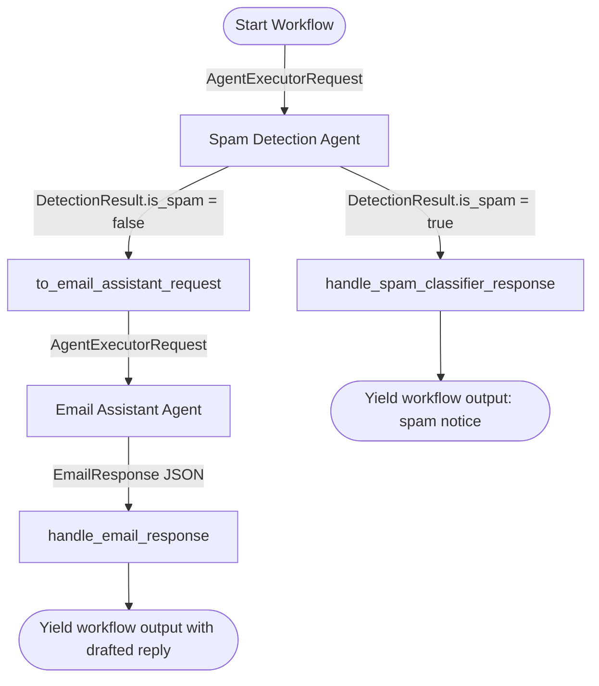

# Email Triage Workflow Diagram

```mermaid
flowchart TD
    Start([Start Workflow]) -->|AgentExecutorRequest| SpamDetector[Spam Detection Agent]
    SpamDetector -->|DetectionResult.is_spam = false| Bridge[to_email_assistant_request]
    Bridge -->|AgentExecutorRequest| EmailAssistant[Email Assistant Agent]
    EmailAssistant -->|EmailResponse JSON| SendEmail[handle_email_response]
    SendEmail --> EndSuccess([Yield workflow output with drafted reply])

    SpamDetector -->|DetectionResult.is_spam = true| SpamHandler[handle_spam_classifier_response]
    SpamHandler --> EndSpam([Yield workflow output: spam notice])
```
