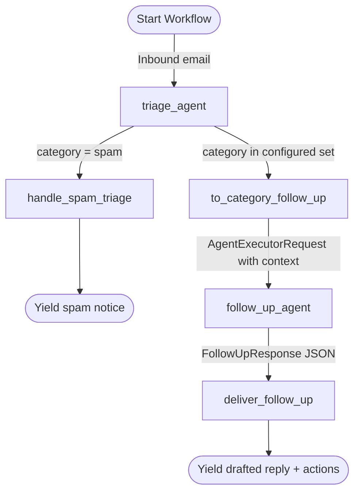

# Generic Email Triage Workflow Diagram

```mermaid
flowchart TD
    Start([Start Workflow]) -->|Inbound email| TriageAgent[triage_agent]

    TriageAgent -->|category = spam| SpamHandler[handle_spam_triage]
    SpamHandler --> EndSpam([Yield spam notice])

    TriageAgent -->|category in configured set| Bridge[to_category_follow_up]
    Bridge -->|AgentExecutorRequest with context| FollowUpAgent[follow_up_agent]
    FollowUpAgent -->|FollowUpResponse JSON| Deliver[deliver_follow_up]
    Deliver --> EndReply([Yield drafted reply + actions])
```
